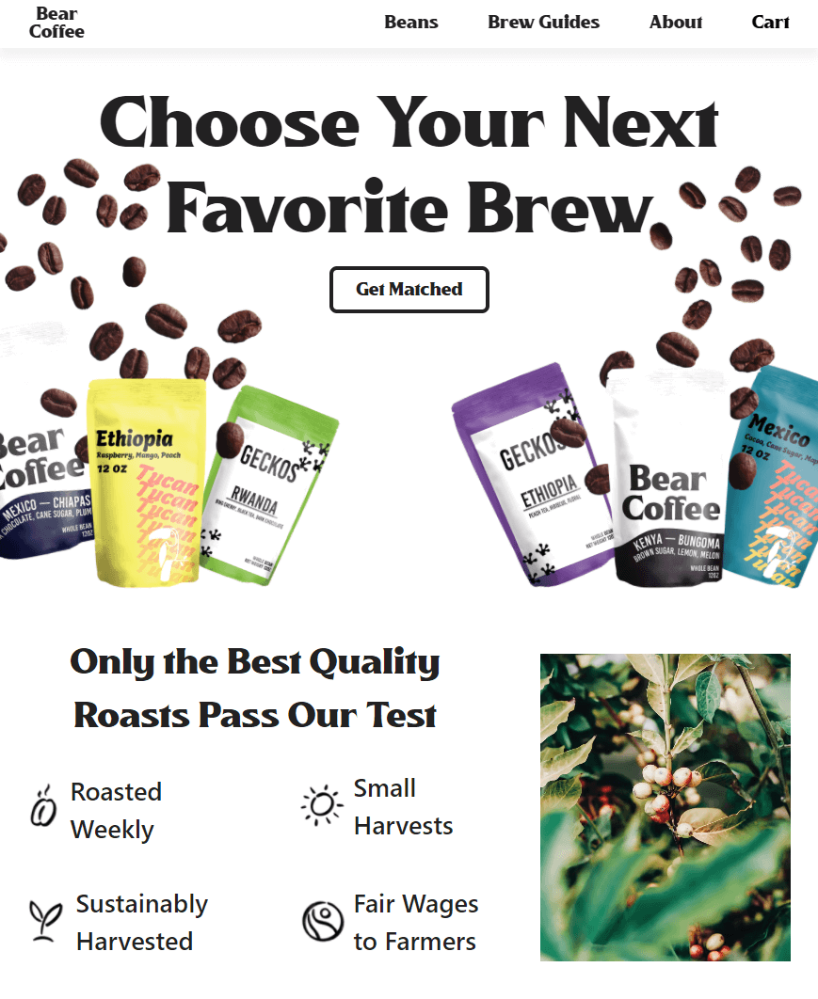
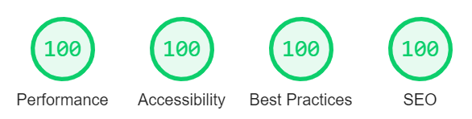

# **Bear Coffee**

**[☕ Coffee E-commerce](https://bearcoffee.netlify.app/)** | Voyage-24 | [https://chingu.io/](https://chingu.io/)

### **A freshly-ground e-commerce store roasted on the JAM stack!**
<a href="https://bearcoffee.netlify.app/" target="_blank">
  

    
  

</a>

<a href="https://lighthouse-dot-webdotdevsite.appspot.com//lh/html?url=https%3A%2F%2Fbearcoffee.netlify.app%2F" target="_blank">
  

    
  

</a>

**[See it live!](https://bearcoffee.netlify.app/)**

[Mobile Demo](https://bearcoffee.netlify.app/demos/mobile_demo.webm)

[Desktop Demo](https://bearcoffee.netlify.app/demos/desktop_demo.webm)

## Features

⚡ Lightweight, snappy, & performant w/ Svelte

⚡ Fully responsive & styled using no CSS frameworks

⚡ Partially hydrated w/ Elder.js

⚡ Optimized images in next-gen formats AVIF / WebP

⚡ Secure payments/checkout w/ Stripe

⚡ Free e-commerce — no monthly fees to get started!

⚡ Zero cold starts & serverless w/ Netlify Functions

## How to Deploy

You'll need a Netlify and Stripe account. Clone the repo and [deploy with Netlify](https://docs.netlify.com/site-deploys/create-deploys/#deploy-with-git). Then simply add your Stripe key to Netlify's [environment variables](https://docs.netlify.com/configure-builds/environment-variables/#declare-variables) as `STRIPE_KEY`.

Note that the data is sourced from Stripe's Products API. You will need to fill in data via the dashboard or API as per the mock data located in `src/hooks.js`.

## The 🐻 Team & Testimonals

**Fang🦁** ([armchair-traveller](https://github.com/armchair-traveller))

> Svelte transitions are nifty and sooo easy to use! Though managing transition states while other transitions were playing proved to be a challenge, it was quite fun. I especially wasn't expecting to whip up a custom toast notification in just a few minutes, but the unbelievable happened with Svelte's transitions and stores!

[**zxcv3**](https://github.com/zxcv3)

> I am surprised how simple it is to write code with svelte. It was quite challenging to use tools that I'm not familiar with, but I could realize its high productivity.

[**rafawelsh**](https://github.com/rafawelsh)

> At first Svelte and Elder.js seemed too hard to understand. Once Fang helped me out with the first steps it was great to work with them! One unexpected learning experience in this endeavor was Figma! As the team's designer, I had to pick up Figma and get a design ready. Overall a great project.

## **Tech**

The what and why we use them.

*It's all JavaScript.*

**Frontend** [Svelte](https://svelte.dev/)

- Svelte's declarative, yet concise syntax allows you to do more with less code. Its design decisions were an important factor in its consideration for this voyage as its syntax is very similar to vanilla JavaScript (plus HTML and CSS) which makes it very easy to onboard members. All while being very lightweight, performant, and readable. This is in no small part thanks to its unique approach of doing work during the compile step as opposed to during run time in the browser like traditional frameworks React and Vue.

**Framework** [Elder.js](https://github.com/elderjs/elderjs)

- A Svelte framework and SSG that has some very interesting tech. Namely, partial hydration (AKA the [Islands Architecture](https://jasonformat.com/islands-architecture/)) which allows it to only hydrate and transfer in components that're visible to the user via Intersection Observer, creating a hyper-optimized website experience. If there's no JavaScript used on a page, there's no JavaScript loaded. This is before even mentioning its shockingly fast build times that make most SSGs look bad.

**Backend** Serverless

- Serverless is a rising and trending web architecture. As anyone who've done anything in a serverless architecture will tell you, "It's all still on servers." Rather, it is the idea of cutting away the management of the server and all its involved complexities, using services and managed solutions. It's the future of computing, and allows the developer to focus on building things rather than managing infrastructure. That makes it very compelling to use in our voyage, where the time to build something isn't as long as you'd like, yet we want to make a solid web app that can scale if necessary. [More info on serverless](https://serverless.css-tricks.com/)

**Payments** [Stripe](https://stripe.com/)

- Payments are hard. There's validation, fraud prevention, security, internationalization, billing, etc. Yet, Stripe takes care of this all for you coupled with its developer-friendly docs and robust APIs. They're not new to payment processing, but they certainly do keep up with trends. Not to mention the attractive pricing with no monthly fees, essentially making it free to start. Maybe that last bit was the main reason we chose it.

**Platform** [Netlify](https://www.netlify.com/)

- The definitive JAM stack platform; they coined the term themselves. A modern hosting platform that can also be described as a serverless platform, and they're quickly gaining mass. From functions to forms, they're able to provide dynamic backend functionality to otherwise static frontend sites... without managing servers. Plus, a generous free tier with no cold-starts like Heroku. That makes it a no-brainer!

## **Project Management**

**Notion**

- Collaborative all-in-one workspace. Nested page structure based notes, wikis, docs, databases, calendar, and more. Uses markdown shortcuts and WYSIWYG. We used it to manage much of our work, write documentation, and internalize many tasks to the point where GitHub Issues were unnecessary.
- **Other details**

## Acknowledgements

**Fang🦁**

> I feel compelled to give credit where credit is due. A shoutout goes to rafawelsh for the amazing designs and content sourcing! Our project would've competed for top dullest designs otherwise. And thanks zxcv3 for the implementing the Carousel and Filter components, one of the few interactive components we have in our project.

[**zxcv3**](https://github.com/zxcv3)

> I have greatly benefited from Fang. He taught me lots of stuffs about svelte and elder.js. Advice and comments given by Fang has been a great help in finishing this project. Also, rafawelsh made enormous contribution to design our website. Thank you for great works.

[**rafawelsh**](https://github.com/rafawelsh)

> I want to give Fang a huge shoutout as he led the team and managed to get everyone onboard to new technologies. This was a difficult project for us all but Fang was able to keep the team working and we made a great product! Also, do you see how cool this README is? Thank you Fang! I need to also give a shoutout to Zxcv3. He and I were new to Svelte and Elder.js but that did not stop Zxcv3 to continue improving in his work. He was able to implement some cool components with technology he had a few weeks to learn.
